# Background
Forecasting spring runoff and river levels is a critical aspect of resource management in regions like the Gallatin Valley in Montana. Accurate predictions of water flow can provide vital information for farmers, recreators, and downstream residents, enabling them to plan and prepare for changing water conditions and floods. This paper seeks to explore the various factors that influence spring runoff and to analyze the feasibility of transfer functions for forecasting water levels in the Gallatin Canyon, taking into account exogenous variables like precipitation and temperature.

For recreators such as kayakers, rafters, and fishermen, understanding river levels is crucial for safety and optimizing enjoyment (the author and author's father have been kayaking this river together for over 20 years). White water kayakers, for example, need to know when the river is at its peak flow to maximize the thrill while ensuring safe conditions. Additionally there are two commercial rafting companies on the section of interest whose business is directly impacted by the peak water period as it means closing their doors to customers for safety concerns. Similarly, fishermen rely on water level forecasts to determine the best times for fishing trips. Furthermore the city of Bozeman's residence, located 40 miles downstream, are directly impacted by flooding of the Gallatin River and nearby tributaries.

In this report, the author will implement transfer function models using R in order to analyze their potential in forecasting river discharge on the Gallatin River.

## Hydrological Characteristics of the Gallatin River
The Gallatin River is a mountain river that flows into a plain valley. Its primary source of water during spring runoff is snowpack from the surrounding mountains. As temperatures rise, snow melts and flows into the river, causing a significant increase in water levels. This seasonal pattern has a direct impact on all stakeholders in the region.

## Data 
This research focuses on predicting the discharge levels of the Gallatin River in Montana. Discharge is measured in cubic feet per second (cfs), a standard metric for evaluating river flow in the United States. The primary dataset (the time series of interest) for this study is collected from Monitoring Location 06043500, which is situated in Gallatin County, Montana. The United States Geological Survey (USGS) site provides current discharge and gage height conditions, and it has historical data dating back to 1989.

To complement the river data and provide an input in the transfer function model, weather information from the Bozeman International Airport (BZN) was used. This airport is located near the Gallatin River and offered similar long-term historical weather records via National Oceanic and Atmospheric Administration (NOAA). The dataset includes daily measurements for precipitation (in millimeters), maximum and minimum daily temperatures (measured in tenths of degrees Celsius), and snowfall. Additional interaction variables were generated in order to capture interaction effects between temperature and precipitation. Weather data is essential to this study, as it helps capture the exogenous variables that contribute to changes in river discharge, such as rainfall and snowmelt.

However, some gaps were found in the weather data for the year 2014 due to unknown reasons. To fill these missing values, supplementary data from a secondary weather station located at Montana State University (MSU) was used (and also hosted by the NOAA). The combined datasets with both airport and university weather were merged in order to provide a complete daily dataset of basic weather attributes that play a role in affecting the Gallatin River's discharge. The summary is listed below:


```r
data = readRDS("data/data_final.rds")
summary(data)
```

```
##     datetime               cfs              PRCP              TMAX       
##  Min.   :1989-08-01   Min.   : 153.0   Min.   :  0.000   Min.   :-310.0  
##  1st Qu.:1998-04-09   1st Qu.: 313.0   1st Qu.:  0.000   1st Qu.:  50.0  
##  Median :2006-12-16   Median : 414.0   Median :  0.000   Median : 139.0  
##  Mean   :2006-12-16   Mean   : 810.2   Mean   :  9.383   Mean   : 139.8  
##  3rd Qu.:2015-08-24   3rd Qu.: 733.8   3rd Qu.:  3.000   3rd Qu.: 239.0  
##  Max.   :2024-05-02   Max.   :8400.0   Max.   :480.000   Max.   : 411.0  
##       TMIN              SNOW           TMAX_PRCP        TMIN_PRCP       
##  Min.   :-427.00   Min.   :  0.000   Min.   :-10507   Min.   :-26352.0  
##  1st Qu.: -72.00   1st Qu.:  0.000   1st Qu.:     0   1st Qu.:     0.0  
##  Median :  -6.00   Median :  0.000   Median :     0   Median :     0.0  
##  Mean   : -17.48   Mean   :  0.854   Mean   :  1273   Mean   :   218.4  
##  3rd Qu.:  56.00   3rd Qu.:  0.000   3rd Qu.:    85   3rd Qu.:     0.0  
##  Max.   : 189.00   Max.   :241.000   Max.   :109440   Max.   : 58560.0
```

# Exploratory Analysis
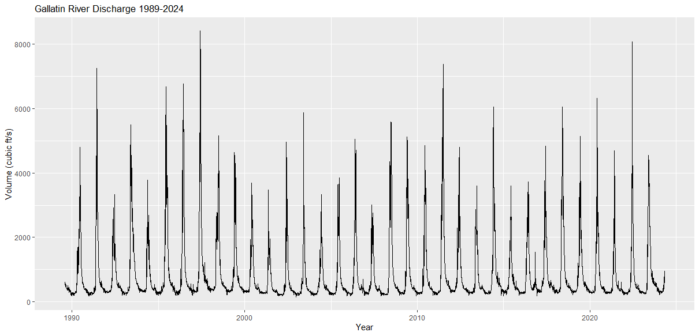{width=.8}

Initial inspection of the data show a clear seasonal pattern following an annual period or 365 days. This follows one's expectations given the seasonality created by annual weather patterns in the mountain region. During winter water is built up and stored in the form of snowpack. With spring, comes warmer weather, increased sunshine and precipitation which melts the snow rapidly, and flows into the streams and rivers of the region. Once the snow pack runs out, the discharge levels quickly return to a more stable level. Notably, the water levels increase exponentially to their peak (usually around early June or late May), and then follow a slower decline through the summer until the general lowest level during the winter. Inspecting the autocorrelation and partial autocorrelation for the series confirms the 365 day period.

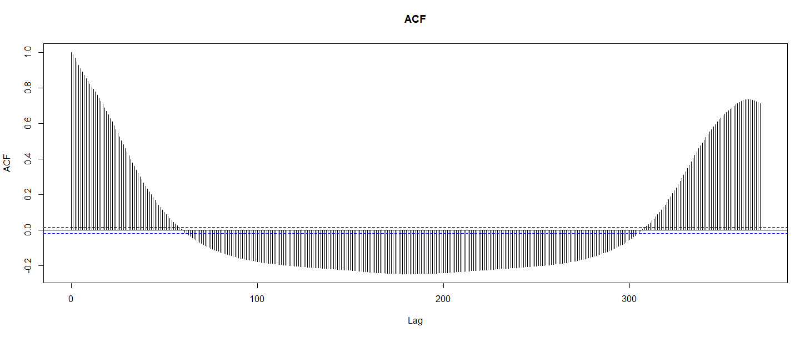{width=.8}

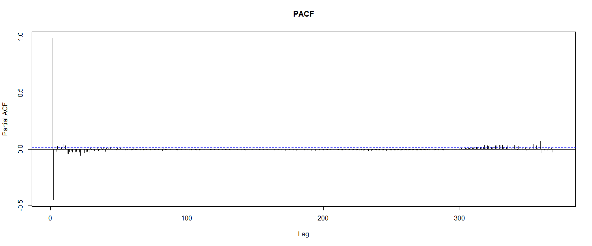{width=.8}

Note that outside the seasonal patterns, the exact date and level of the peak discharge vary from year to year. Some peaks far exceed others largely depending on the rate at which the snow melts, and the amount of snow there is to melt. We can illustrate this by folding the data along years and plotting the series along the "day of year" and highlighting each year as a group.

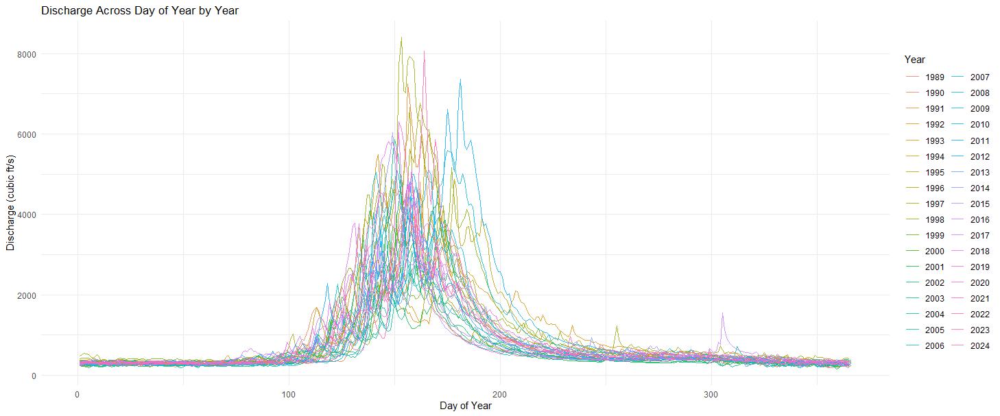{width=.9}
The above plot also gives a clear indication of time dependent variance. During the peak days of the year, there is a lot of variance and very little during the winter months. We can see how the data becomes much more unpredictible during the peak season as the density of the lines become much more spead out relative to the other parts of the year. This will be a problem later since it makes it difficult to make the series stationary (even with transformations). Lastly, we need to analyze how discharge moves with the available input variables. The author found that the most significant input variable was precipitation. Logically this makes sense as precipitation will immediately flow into the river but can also have a lagged affect in the form of upstream flows, snow at higher elevations, and general distance/time taken for the additional water to affect flow at the measurement station. 

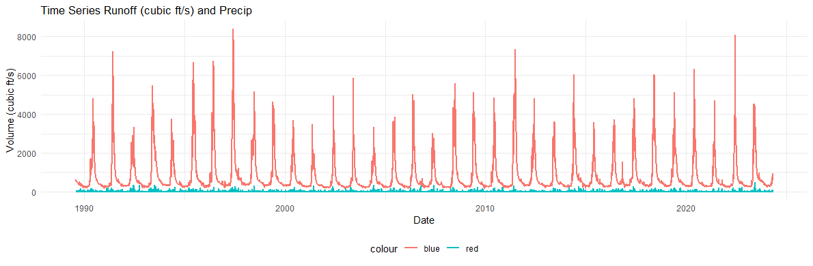{width=.9}

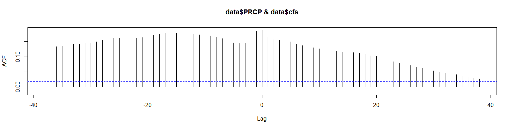{width=.9}

The above two plots show how the two variables, precipitation (PRCP) and discharge (cfs) move together as well as along their lags. Note that the correlations near lag zero jump out further than the neighboring lines - especially in the negative lag direction. This is promising since it is evidence of precipitation leading increases discharge. However, there are un-adjusted seasonal patterns here that seem to be most precedent over the lagged correlations.


# Baseline Model
Before implementing transfer functions, the researcher thought it important to try a simpler model and identify shortcomings and failures before moving onto transfer functions. Given the findings of exploratory analysis, a set of SARIMA models were fit to the discharge time series. During the model selection phase, evidence was pointing to the $daily$ series being poorly modeled by `ARIMA` family models. At this point it seemed the best route would be to smooth the data by aggregating from the daily level to weekly. A `SARIMA(2, 0, 1)X(0, 1, 0)[52]` model gave the best diagnostics but failed to have stationary and normal residuals. The 20 step ahead forecast of the baseline `SARIMA` model are visualized below. Note that while the `ar1` estimate below may not be statistically significant, it appeared to hold practical significance. Other models with all statistically significant coefficients performed poorer in achieving stationary and normal residual fits for the series.

{width=.9}


```text
z test of coefficients:

    Estimate Std. Error z value  Pr(>|z|)    
ar1 0.112951   0.106220  1.0634    0.2876    
ar2 0.498121   0.087559  5.6890 1.278e-08 ***
ma1 0.725535   0.097648  7.4301 1.085e-13 ***
---
Signif. codes:  0 ‘***’ 0.001 ‘**’ 0.01 ‘*’ 0.05 ‘.’ 0.1 ‘ ’ 1
```

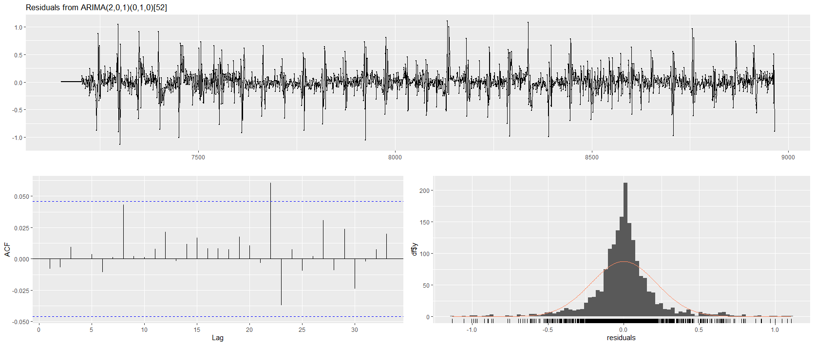{width=.9}

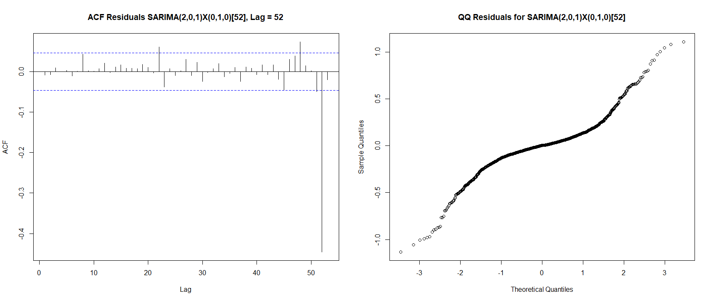{width=.9}
Although the forecast for weekly discharge looks promising and captures the seasonal peak that we expect this year, the residuals fail to be stationary and normal. The non-normality of the residuals can be seen in the histogram and the clearly heavy-tailed QQ plot. As for the stationarity of residuals, we can see there are still regular seasonal spikes in the top residual plot which are also seen in the 52 lag ACF plot. Besides significant autocorrelation at the lag 52, there are additional significant autocorrelations leading up to it. A Ljung-Box test p-value of less than 2.2e-16 also provides strong evidence of significant autocorrelation in the residuals. All the aforementioned diagnostics indicate that the confidence intervals we have established may be misleading, as they violate the normality assumption and may yield estimates outside the expected distribution. Additionally the presence of non-stationary and correlated residuals imply that the model may not adequately capture all the underlying patterns and dynamics in the time series.

Fitting simpler `SARIMA` models before implementing the transfer functions gave several helpful insights. Namely that the autoregressive family of models were failing to represent the discharge time series well. The series is long and has extreme periodic variance (which can be seen in the above residuals still). Logging the series and performing Box-Cox transformations on the series was marginally helpful for finding a stationary model but were by no means a solution. 

# A Model Implementing Transfer Functions
Despite `ARIMA` and `SARIMA` models proving difficult to properly model the series, the researcher moved forward with attempting to forecast Gallatin River discharge with transfer functions. Considering transfer functions can account for the affects of an input on a separate output series, perhaps the extreme variance during peak runoff could help be accounted for by precipitation as an input. Multiple inputs were considered (precipitation, daily high and low temperature, as well as their interactions were tested), but precipitation showed better results in terms of strong evidence as a leading variable, domain knowledge, and end residuals. As a note, further explorations of daily minimum temperature could also be helpful as it exhibited strong correlation with discharge.

In order to whiten the output variable (discharge) a `SARIMA(3, 0, 2)X(0, 1, 0)` model was fit to the input variable (precipitation). The output variable was then whitened using $\tilde{y}_t = \alpha(B)w_t + \tilde{\eta}_t$ with estimated parameters $\phi_1 = 0.08$ (.70), $\phi_2 = -0.006$ (.63), $\phi_3 = -0.03$ (.09), $\theta_1 = -0.08$ (.70), and $\theta_2 = -0.006$ (.53) where the standard errors are in parentheses. None of the aforementioned estimates are statistically significant and were one of the only set of parameters that yielded half-decent diagnostics. The cross correlation of $\tilde{y}$ and $w$ was then analyzed using the following plots and inform the intermediate regression:
$$
\omega (B) y_t = \delta(B) B^d x_t + \omega(B) \eta_t
$$

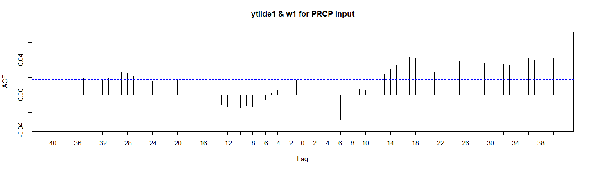{width=.95}
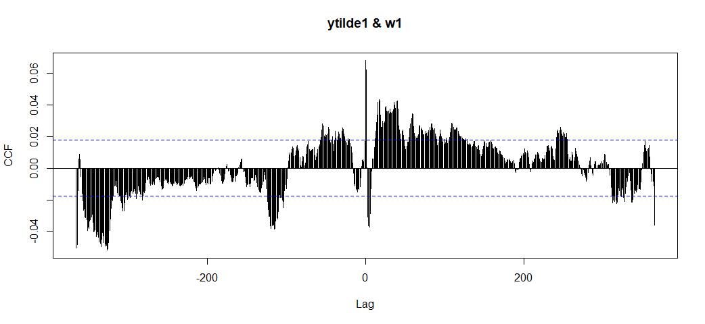{width=.95}
The above graphs showed promising results. We see that the zero and one lagged correlations were significant as well as some significant - but decaying - positive lags. However, there is also significant correlations on the negative end of the 365 lag window graph. When working with these series, there always seemed to be a tradeoff between eliminating the annual seasonality at the cost of introducing autocorrelation at the end of the period (or in this case, cross correlation at the beginning and end of the 365 cross-correlation).

The intermediate regression was estimated as:

```text
lm(formula = y0 ~ x2 + y1 + y2 - 1)

Residuals:
     Min       1Q   Median       3Q      Max 
-2205.62   -25.34    -0.11    25.41  2231.53 

Coefficients:
    Estimate Std. Error t value Pr(>|t|)    
x2 -1.007210   0.040387  -24.94   <2e-16 ***
y1  1.380489   0.007886  175.05   <2e-16 ***
y2 -0.435759   0.007890  -55.23   <2e-16 ***
---
Signif. codes:  0 ‘***’ 0.001 ‘**’ 0.01 ‘*’ 0.05 ‘.’ 0.1 ‘ ’ 1

Residual standard error: 170.7 on 12324 degrees of freedom
Multiple R-squared:  0.9384,	Adjusted R-squared:  0.9383 
F-statistic: 6.253e+04 on 3 and 12324 DF,  p-value: < 2.2e-16
```

Where `y1` and `y2` represent one and two time steps behind the current value of the seasonally adjusted discharge data `y0`, and `x2` represents the two step behind value of the seasonally adjusted input variable (precipitation).

The above model gave residuals in the form of:

{width=.90}

Clearly the above residuals are not stationary (when they should be) but the last step in transfer function process is to fit an `ARMA` model to the above residuals. The found model to the above residuals' series was estimated as `ARIMA(3,0,4)` with zero mean:

```text
     Estimate Std. Error  z value  Pr(>|z|)    
ar1 -0.692858   0.052192 -13.2753 < 2.2e-16 ***
ar2  0.718534   0.015171  47.3610 < 2.2e-16 ***
ar3  0.727631   0.040230  18.0869 < 2.2e-16 ***
ma1  2.150689   0.053057  40.5357 < 2.2e-16 ***
ma2  1.738692   0.076768  22.6485 < 2.2e-16 ***
ma3  0.561794   0.042031  13.3662 < 2.2e-16 ***
ma4  0.052765   0.014636   3.6051  0.000312 ***
---
```
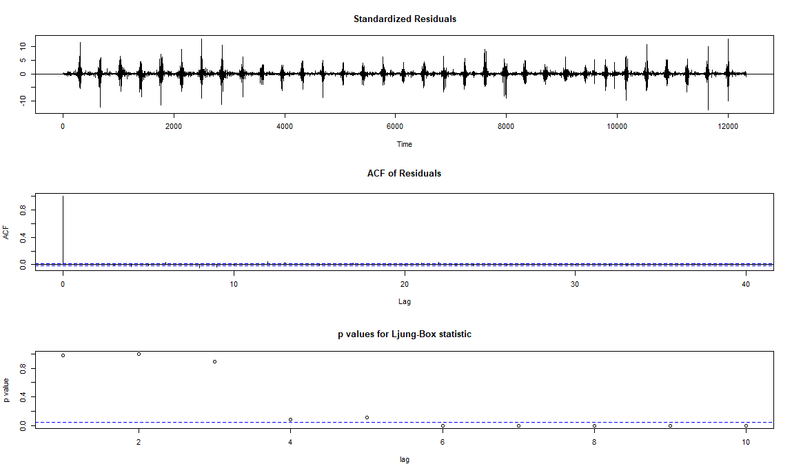{width=.95}
The above diagnostics are not ideal to say the least. All three plots we use to diagnose a models' fit fail as well as inspecting the normality overall. The researcher would not recommend this model be used in any fashion to predict daily discharge on the Gallatin River.


# Conclusion
Forecasting river discharge, particularly for the Gallatin River, presented complex challenges to which this research did not find the solution to. The exploratory analysis revealed the highly seasonal and volatile nature of the discharge data, with significant annual variations driven by snowmelt and weather patterns. The initial weekly SARIMA models demonstrated some capacity to capture the general seasonality, but they aslo fell short in providing accurate forecasts due to non-stationarity, high variance, and failing normality assumptions.

Implementing a transfer function model allowed for a more complex approach by accounting for the effects of exogenous variables like precipitation. The transfer function model aimed to leverage the direct impact of precipitation on river discharge. The researcher hoped that this approach could better manage the observed variance and provide more reliable forecasts. However, despite best efforts, the transfer function model faced significant issues with residual diagnostics, autocorrelation, and cross-correlation patterns, indicating underlying problems with the model's structure and assumptions. Moreover, adding input variables to our forecasts adds additional complexity in interpreting the estimates and requires forecasting additional input series in order to get the forecast of the target series.

Overall this time series was poorly modeled by any approach involving the `ARIMA` family of models. Any attempts to remove the seasonality of the daily data resulted it introducing systematic autocorrelation in other parts of the series. Discharge, when aggregated and smoothed from daily to that of a longer observation window, behaved better for models incorporating `ARIMA` and `SARIMA`. But such methods were outside of the scope for modelling daily discharge as they render the stake-holders' ability to predict the daily mean discharge obsolete via obfuscating the daily values inside a longer aggregated time window.

# References
NOAA. "Global Historical Climatology Network - Daily (GHCN-Daily), Version 3", accessed May 5, 2024 at the URL https://www.ncei.noaa.gov/access/search/data-search/daily-summaries?pageNum=1&startDate=1989-08-01T23:59:59&endDate=2024-05-04T00:00:00&bbox=45.864,-111.415,45.195,-110.932

U.S. Geological Survey, 2024, Gallatin River near Gallatin Gateway, MT - 06043500, accessed May 5, 2024 at URL https://waterdata.usgs.gov/monitoring-location/06043500/#parameterCode=00065&period=P7D&showMedian=false

#### The code for this project can be viewed at
Repository: https://github.com/vaughankraska/timeseries_analysis
